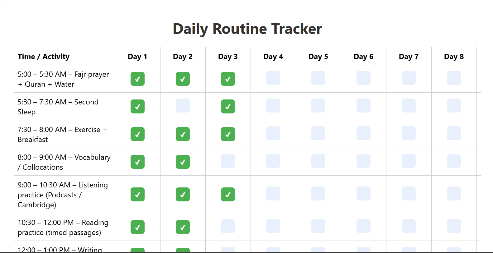

# 🌟 Daily Routine Tracker

A web-based **Daily Routine Tracker** to help you manage your IELTS preparation, web development practice, and daily activities in an interactive, Excel-style table. Track your progress day by day and mark completed tasks. ✅

---

## 🌐 Live Demo
[🚀 Try the app online](https://your-live-demo-link.netlify.app)

---

## ✨ Features

- 🗓 **Interactive Table** – Days × Activities format
- ✔ **Mark Completed Tasks** – Click buttons to check off activities
- 💾 **LocalStorage Support** – Progress saved automatically
- 📱 **PWA Ready** – Works offline with caching
- 🎨 **Responsive UI** – Clean, user-friendly, and mobile-ready

---

## 🗂 Project Structure

Daily-Routine-Tracker/
│
├─ index.html # Main HTML file
├─ style.css # Styling for table and layout
├─ script.js # Table generation, button clicks & localStorage
├─ manifest.json # PWA manifest file
├─ service-worker.js # Offline caching via service worker
├─ icon-192.png # App icon (192x192)
└─ icon-512.png # App icon (512x512)

---

## ⚙️ How to Run

1. Clone or download the repository.  
2. Open `index.html` in your browser.  
3. Click on buttons to mark tasks as completed. ✅  
4. Progress is saved automatically via **localStorage**.  
5. Install as a PWA to use offline on your device.

---

## 🛠 Technologies Used

- **HTML5** – Page structure  
- **CSS3** – Styling & responsive layout  
- **JavaScript (ES6)** – Dynamic table & event handling  
- **PWA** – `manifest.json` & service worker for offline caching  

---

## 📸 Screenshot

---

## 👩‍💻 Author
**Shamila Sharmin**  

**📅 Date:** 2025  
**📄 License:** MIT

